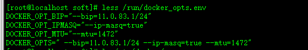
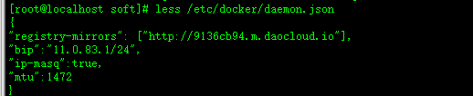

== 安装

环境:
[width="100%",options="header,footer"]
|====================
| 名称 | ip  
|master| 192.168.174.130
|node1 | 192.168.174.131
|node2 |192.168.174.132
|node3 |192.168.174.133
|====================
=== master
==== 安装
. 首先下载k8s
+
https://github.com/kubernetes/kubernetes/releases/download/v1.5.7/kubernetes.tar.gz
+
. 解压
+
tar -xvf kubernetes.tar.gz 
. 进入 kubernetes/cluster/ 执行命令./get-kube-binaries.sh
+
. 根据提示移动处理文件
+
. 进入server 解压kubernetes-server-linux-amd64.tar.gz

. 导入镜像
.. 下载etcd 镜像
+
docker pull googlecontainer/etcd:2.2.1
.. 导入master相关镜像
... 进入上面解压的kubernetes-server-linux-amd64.tar.gz 里面的bin目录进行镜像导入
+
... 使用docker load -i 镜像.tar 来导入
* docker load < kubernetes/server/bin/kube-proxy.tar
* docker load < kubernetes/server/bin/kube-apiserver.tar
* docker load < kubernetes/server/bin/kube-controller-manager.tar
* docker load < kubernetes/server/bin/kube-scheduler.tar

. 启动etcd
+
-----
docker run -d  --name etcd \ <1>
-v /usr/local/etcd:/default.etcd <2>
-p 2379:2379 \ <3>
-p 2380:2380 \ <4>
-p 4001:4001 \ <5>
-p 7001:7001 \ <6>
googlecontainer/etcd:2.2.1 \ <7>
etcd \ <8>
--listen-peer-urls 'http://0.0.0.0:2380,http://0.0.0.0:7001'  \ <9>
--listen-client-urls='http://0.0.0.0:2379,http://0.0.0.0:4001'  \ <10>
--advertise-client-urls 'http://0.0.0.0:2379,http://0.0.0.0:4001' <11>
-----
<1> 后台执行并取名为etcd
<2> 挂载目录到etcd容器中。默认etcd使用的存储目录在/default.etcd 可以使用参数--data-dir 来指定其他的存储目录
<3> 暴露2379端口提供 HTTP API 服务端口
<4> 暴露2380端口用于与peer 通信
<5> 暴露4001端口提供http api服务端口(老版本使用端口)
<6> 暴露7001端口用于与peer通信(老版本使用使用端口)
<7> 使用的etcd镜像
<8> 执行etcd命令
<9> 监听URL，用于与其他节点通讯
<10> 监听URL，用于与其他节点通讯
<11> 通知客户端url, 也就是服务的url
+
. 设置网络范围
+
----
docker exec -it etcd etcdctl \ <1>
set /github.myking520.com/network/config \ <2>
'{"Network": "11.0.0.0/16"}'  <3>
----
<1> 执行etcdctl 设置网络访问
<2> 设置键
<3> 网络范围 +
. 安装flannel (所有节点) +
.. 下载 + 
flannel-v0.7.1-linux-amd64.tar.gz
.. 解压
tar -xvf flannel-v0.7.1-linux-amd64.tar.gz
.. 启动 
+
--------
./flanneld \
  -etcd-endpoints="http://master:2379" \ <1>
  -etcd-prefix="/github.myking520.com/network/" \ <2>
  -iface=eno16777736 <3>
--------
<1> etcd的api地址
<2> etcd中存储的键前缀（不包含config否则会出现Failed to retrieve network config: 104: Not a directory）
<3> 网卡名称
.. 生成docker相关信息 +
./mk-docker-opts.sh 
.. 修改配置
+
 /etc/docker/daemon.json 
+
... 根据/run/docker_opts.env 的参数对应修改daemo.json中的配置信息 
+
 

... 重启docker

==== 启动

. 启动apiserver
+
------
docker run -d \
--name=apiserver \ <1>
-p 8080:8080 \ <2>
gcr.io/google_containers/kube-apiserver:77e85c0207d0e512f452ed2febfca00b \ <3>
kube-apiserver \ <4>
--insecure-bind-address="0.0.0.0" \ <5>
--service-cluster-ip-range="11.0.0.0/16" \ <6>
--etcd-servers="http://192.168.174.130:4001" \ <7>
--secure-port=0 \ <8>
--admission-control="NamespaceLifecycle,NamespaceExists,LimitRanger,SecurityContextDeny,ServiceAccount,ResourceQuota" \ <9>
--v=2 \ <10>
--storage-backend=etcd2 <11>
------
<1> 取名为apiserver
<2> 保留8080端口
<3> apiserver的镜像
<4> 执行kube-apiserver 命令
<5> 非安全端口绑定地址
<6> service ip范围
<7> etcd 服务器地址
<8> 安全访问端口0表示关闭https
<9> 访问控制策略
<10> 日志等级
<11> 存储

. 启动 controller-manager
+
---------
docker run -d \
--name=cm \ <1>
-p 10252:10252 \ <2>
gcr.io/google_containers/kube-controller-manager:c1080c7475e007144aaf0150cc06d670 \ <3>
kube-controller-manager \ <4>
--master=http://192.168.174.130:8080 <5>
---------
<1> 取名为cm
<2> 暴露10252端口(controller manger 监听的 HTTP 端口)
<3> kube-controller-manager 镜像
<4> 执行命令kube-controller-manager 
<5> master API 的地址，会覆盖 kubeconfig 里面 master API 的值
. 启动 scheduler
+
-----
docker run -d \
--name=scheduler \ <1>
-p 10251:10251 \ <2>
gcr.io/google_containers/kube-scheduler:ad3b8e3a0d77d9cdfaa5920ba237a0bb \ <3>
kube-scheduler \ <4>
--master=http://192.168.174.130:8080 <5>
-----
<1> 取名为scheduler
<2> 暴露10251端口
<3> kube-scheduler镜像
<4> 执行kube-scheduler命令
<5> master API 的地址
. 查看信息 +
./kubectl -s master:8080 version

=== node

. 启动kubelet 
+
------
./kubelet \
 --api-servers=192.168.78.134:8080 \ <1>
 --node-ip=192.168.78.134 \ <2>
 --hostname_override=192.168.78.134 <3>
------
<1> api server地址 多个的话请使用多个
<2> 节点的ip
<3> 设置节点的名称
. 启动kube-proxy
./kube-proxy --master=192.168.78.134:8080 

=== 状态查看
命令来查看pod、replication controller、service和endpoint
------
 ./kubectl -s 192.168.78.134:8080 get po
 ./kubectl -s 192.168.78.134:8080 get rc
 ./kubectl -s 192.168.78.134:8080 get svc
 ./kubectl -s 192.168.78.134:8080 get ep  
------
=== etc 说明

==== 端口

* 2379 提供 HTTP API 服务
* 2380 与peer 通信
* 4001 是老的http api服务端口 已经被2379 所替换
* 7001 同样被2380所替换是老的端口
